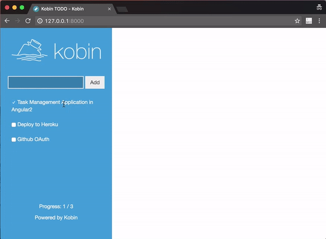

# kobin-example

Example application in Kobin python web-framework.




## How to run

Compile TypeScript and SCSS

```console
$ mkdir -p public/static/js
$ npm install
$ npm run build
```

Setup python interpreter

```console
$ python3 -m venv venv
$ source venv/bin/activate
$ pip install -r requirements.txt
$ python manage.py migrate
```

Start running Redis

```console
$ docker-compose up -d
```

Set Environment Variables

```sh
export KOBIN_TODO_ENV=develop
export KOBIN_TODO_GITHUB_CLIENT_ID=xxxxxxxxxxxxxxxxxxxx
export KOBIN_TODO_GITHUB_CLIENT_SECRET=xxxxxxxxxxxxxxxxxxxxxxxxxxxxxxxxxxxxxxxx
```

Run

```
$ python manage.py run
```


## Docker

**NOW, this cannot work in Docker. Help wanted.**

```
$ docker build -t c-bata/kobin .
$ docker run -d -p 80:8080 --name kobin c-bata/kobin
```
